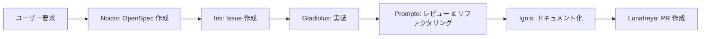

# FF15 OpenSpec Agents

[English](README.md) | [日本語](README.ja.md)

GitHub Copilot エージェントオーケストレーションと OpenSpec による仕様駆動開発

## 概要

このリポジトリは、GitHub Copilot のマルチエージェント機能を使った**エージェントオーケストレーション**と、**[OpenSpec](https://github.com/Fission-AI/OpenSpec)** による仕様駆動開発を組み合わせたサンプルです。

エージェントのオーケストレーションでは、仕様が不明確だとサブエージェントが意図しない実装を行う場合があります。このプロジェクトでは、**OpenSpec** を使って事前に権威ある仕様を定義することで、この問題に対処しています。サブエージェントは、合意された仕様に基づいてコードを実装・リファクタリングすることで、予測可能で監査可能な開発を実現します。

### なぜ FF15？

エージェントチームは **ファイナルファンタジー XV** のキャラクターにインスパイアされており、それぞれが明確な役割を持っています：

- **Noctis（ノクティス）** - オーケストレーター & OpenSpec 作成
- **Iris（イリス）** - GitHub Issue 管理
- **Gladiolus（グラディオラス）** - TDD 実装スペシャリスト
- **Prompto（プロンプト）** - コード品質 & リファクタリング
- **Ignis（イグニス）** - ドキュメント & アーカイブ
- **Lunafreya（ルナフレーナ）** - プルリクエスト作成

## 特徴

✅ **仕様駆動開発** - OpenSpec を使って実装前に仕様を定義  
✅ **役割ベースのエージェントオーケストレーション** - 専門エージェント間での明確な関心の分離  
✅ **人間と AI の協調** - 人間が仕様を承認し、AI が自律的に実装  
✅ **追跡可能な開発** - OpenSpec の提案とアーカイブですべての変更を追跡  
✅ **品質保証** - 組み込みのレビューポリシーと TDD 原則

## 前提条件

- **Node.js** >= 20.19.0 ([ダウンロード](https://nodejs.org/))
- **GitHub Copilot**（VS Code または互換エディタ）
- **Git**（バージョン管理用）
- **OpenSpec CLI**（以下のインストール手順）

## クイックスタート

### 1. OpenSpec のインストール

```bash
npm install -g @fission-ai/openspec@latest
```

インストールの確認：

```bash
openspec --version
```

### 2. プロジェクトの初期化

```bash
cd your-project
openspec init
```

初期化プロセス：
- AI ツール（Claude Code、Cursor など）の選択を促されます
- プロジェクトルートに `AGENTS.md` を作成
- `openspec/` ディレクトリ構造をセットアップ
- AI アシスタント用のスラッシュコマンドを設定

**重要**: スラッシュコマンドを有効にするため、初期化後に AI アシスタントを再起動してください。

### 3. FF15 エージェントのデプロイ

AI アシスタント（GitHub Copilot）で以下を実行：

```
ff15-openspec-agents-sync スキルを実行して、エージェント定義とポリシーをデプロイしてください
```

これにより：
- エージェント定義を `.claude/agents/` に同期
- ポリシードキュメントを `docs/` にデプロイ
- OpenSpec ワークフローを設定

### 4. 開発開始

AI アシスタントに提案の作成を依頼：

```
ユーザー認証を追加する OpenSpec 提案を作成してください
```

ワークフローが仕様作成、実装、レビュー、PR 作成までガイドします。

## プロジェクト構成

```
ff15-openspec-agents/
├── .claude/
│   ├── agents/                         # エージェント定義（Noctis、Iris など）
│   └── skills/
│       └── ff15-openspec-agents-sync/  # エージェント同期用スキル
│           ├── SKILL.md
│           ├── USAGE.md                # 詳細な使用ガイド
│           └── scripts/
├── openspec/
│   ├── AGENTS.md                       # OpenSpec ワークフロー手順
│   ├── project.md                      # プロジェクトコンテキスト & 規約
│   ├── changes/                        # アクティブな提案
│   │   └── archive/                    # 完了した変更
│   └── specs/                          # コンポーネント仕様
├── docs/                               # 開発ポリシー
│   ├── development-policy.md
│   ├── testing-policy.md
│   ├── review-policy.md
│   └── deployment-policy.md
└── AGENTS.md                           # ルートエージェント指示
```

## エージェント

### Noctis - オーケストレーター & OpenSpec 作成者
ワークフロー全体を調整し、詳細な仕様を含む OpenSpec 提案を作成します。

### Iris - Issue マネージャー
ユーザー要件と提案に基づいて GitHub Issue を作成・管理します。

### Gladiolus - 実装スペシャリスト
OpenSpec 仕様に導かれ、TDD 原則に従って実装を実行します。

### Prompto - コード品質エキスパート
OpenSpec に対してコードをレビューし、レビューポリシーを適用し、明確性と保守性のためにリファクタリングします。

### Ignis - ドキュメントスペシャリスト
ドキュメントを更新し、完了した OpenSpec 変更をアーカイブし、ドキュメントの完全性を確保します。

### Lunafreya - PR 作成者
完了した実装のプルリクエストを、適切な説明とリンク付きで作成します。

## 開発ワークフロー



**典型的なフロー:**

1. **要求** → ユーザーが機能や変更を説明
2. **仕様化** → Noctis が OpenSpec 提案を作成
3. **Issue 追跡** → Iris が GitHub Issue を作成
4. **実装** → Gladiolus が TDD に従って実装
5. **品質レビュー** → Prompto がレビューとリファクタリング
6. **ドキュメント化** → Ignis がドキュメントを更新し仕様をアーカイブ
7. **プルリクエスト** → Lunafreya がレビュー用 PR を作成

## 使用ガイド

FF15 OpenSpec ワークフローの詳細な使用方法については、以下を参照してください：

📖 [.claude/skills/ff15-openspec-agents-sync/USAGE.md](.claude/skills/ff15-openspec-agents-sync/USAGE.md)

## トラブルシューティング

### OpenSpec コマンドが見つからない

OpenSpec がグローバルにインストールされていることを確認：

```bash
npm install -g @fission-ai/openspec@latest
```

`openspec --version` で確認してください。

### エージェントが認識されない

1. `.claude/agents/` ディレクトリにエージェント定義があることを確認
2. `ff15-openspec-agents-sync` スキルを実行して再同期
3. AI アシスタントを再起動

### スキル同期が失敗する

プロジェクトが正しい構造を持ち、スキルディレクトリが存在することを確認：

```bash
ls .claude/skills/ff15-openspec-agents-sync/
```

## ベストプラクティス

- **常に OpenSpec から始める** - コーディング前に提案を作成
- **project.md を最新に保つ** - 規約とアーキテクチャを文書化
- **実装前に提案をレビュー** - 人間の承認で整合性を確保
- **ポリシードキュメントを使用** - 標準として `docs/*-policy.md` を参照
- **完了した変更をアーカイブ** - 将来の参照のために履歴を維持

## 参考資料

- **OpenSpec**: https://github.com/Fission-AI/OpenSpec
- **OpenSpec 公式サイト**: https://openspec.dev/
- **詳細な使用ガイド**: [USAGE.md](.claude/skills/ff15-openspec-agents-sync/USAGE.md)

## ライセンス

MIT License - 詳細は [LICENSE](LICENSE) ファイルを参照

---

**GitHub Copilot と OpenSpec で ❤️ を込めて構築**
