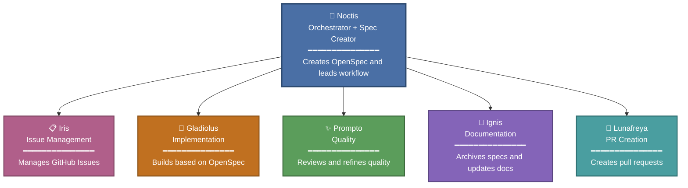
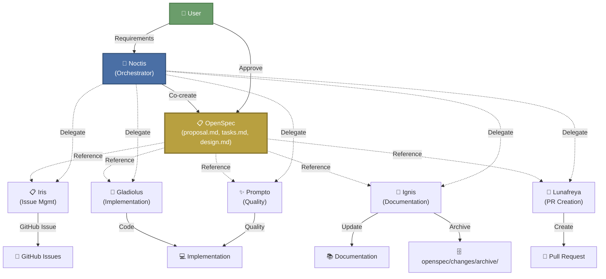

# FF15 OpenSpec Agents

[English](README.md) | [日本語](README.ja.md)

GitHub Copilot Agent Orchestration with OpenSpec-Driven Development

## Overview

This repository demonstrates **agent orchestration** using GitHub Copilot's multi-agent capabilities, combined with **[OpenSpec](https://github.com/Fission-AI/OpenSpec)** for specification-driven development.

When orchestrating subagents, unclear specifications can lead to unintended implementations. This project addresses that by using **OpenSpec** to define authoritative specifications upfront. Subagents then implement and refactor code based on these agreed-upon specs, ensuring predictable and auditable development.

### Why FF15?

The agent team is inspired by **Final Fantasy XV** characters, each with distinct roles:

- **Noctis** - Orchestrator & OpenSpec Creator
- **Iris** - GitHub Issue Manager
- **Gladiolus** - TDD Implementation Specialist
- **Prompto** - Code Quality & Refactoring
- **Ignis** - Documentation & Archiving
- **Lunafreya** - Pull Request Creator

### Team Structure

Noctis acts as the central orchestrator, coordinating specialized agents:



Each agent has a specific domain of expertise and works autonomously within their role, while Noctis ensures cohesive workflow orchestration.

## Features

✅ **Specification-Driven Development** - Define specs before implementation using OpenSpec  
✅ **Role-Based Agent Orchestration** - Clear separation of concerns across specialized agents  
✅ **Human-AI Collaboration** - Humans approve specs; AI implements autonomously  
✅ **Traceable Development** - All changes tracked via OpenSpec proposals and archives  
✅ **Quality Assurance** - Built-in review policies and TDD principles

## Prerequisites

- **Node.js** >= 20.19.0 ([Download](https://nodejs.org/))
- **GitHub Copilot** (VS Code or compatible editor)
- **Git** (for version control)
- **OpenSpec CLI** (installation steps below)

## Quick Start

### 1. Install OpenSpec

```bash
npm install -g @fission-ai/openspec@latest
```

Verify installation:

```bash
openspec --version
```

### 2. Initialize Your Project

```bash
cd your-project
openspec init
```

The initialization process:
- Prompts you to select your AI tool (Claude Code, Cursor, etc.)
- Creates `AGENTS.md` in your project root
- Sets up `openspec/` directory structure
- Configures slash commands for your AI assistant

**Important**: Restart your AI assistant after initialization to enable slash commands.

### 3. Deploy FF15 Agents

In your AI assistant (GitHub Copilot), execute:

```
Run the ff15-openspec-agents-sync skill to deploy agent definitions and policies
```

This will:
- Sync agent definitions to `.claude/agents/`
- Deploy policy documents to `docs/`
- Configure the OpenSpec workflow

### 4. Start Developing

Request your AI assistant to create a proposal:

```
Create an OpenSpec proposal for adding user authentication
```

The workflow will guide you through specification, implementation, review, and PR creation.

## Project Structure

```
ff15-openspec-agents/
├── .claude/
│   ├── agents/                         # Agent definitions (Noctis, Iris, etc.)
│   └── skills/
│       └── ff15-openspec-agents-sync/  # Skill for syncing agents
│           ├── SKILL.md
│           ├── USAGE.md                # Detailed usage guide
│           └── scripts/
├── openspec/
│   ├── AGENTS.md                       # OpenSpec workflow instructions
│   ├── project.md                      # Project context & conventions
│   ├── changes/                        # Active proposals
│   │   └── archive/                    # Completed changes
│   └── specs/                          # Component specifications
├── docs/                               # Development policies
│   ├── development-policy.md
│   ├── testing-policy.md
│   ├── review-policy.md
│   └── deployment-policy.md
└── AGENTS.md                           # Root agent instructions
```

## Agents

### Noctis - Orchestrator & OpenSpec Creator
Coordinates the entire workflow and creates OpenSpec proposals with detailed specifications.

### Iris - Issue Manager
Creates and manages GitHub Issues based on user requirements and proposals.

### Gladiolus - Implementation Specialist
Executes implementation following TDD principles, guided by OpenSpec specifications.

### Prompto - Code Quality Expert
Reviews code against OpenSpec, applies review policies, and refactors for clarity and maintainability.

### Ignis - Documentation Specialist
Updates documentation, archives completed OpenSpec changes, and ensures documentation completeness.

### Lunafreya - PR Creator
Creates pull requests for completed implementations with proper descriptions and links.

## Development Workflow

### OpenSpec-Driven Collaboration

The workflow centers around **OpenSpec** as the single source of truth. Users and Noctis collaboratively create specifications, which all agents reference during implementation:



**Key Points:**
- 📋 **OpenSpec is central** - All agents reference the same specification
- 👤 **Human approval required** - Users approve specs before implementation
- 🔄 **Coordinated execution** - Noctis delegates to specialized agents
- 📚 **Traceable changes** - All work links back to the original spec

**Typical Flow:**

1. **Request** → User describes a feature or change
2. **Specification** → Noctis creates an OpenSpec proposal
3. **Issue Tracking** → Iris creates GitHub Issue(s)
4. **Implementation** → Gladiolus implements following TDD
5. **Quality Review** → Prompto reviews and refactors
6. **Documentation** → Ignis updates docs and archives spec
7. **Pull Request** → Lunafreya creates PR for review

## Usage Guide

For detailed instructions on using the FF15 OpenSpec workflow, see:

📖 [.claude/skills/ff15-openspec-agents-sync/USAGE.md](.claude/skills/ff15-openspec-agents-sync/USAGE.md)

## Troubleshooting

### OpenSpec command not found

Ensure OpenSpec is installed globally:

```bash
npm install -g @fission-ai/openspec@latest
```

Verify with `openspec --version`.

### Agents not recognized

1. Verify `.claude/agents/` directory contains agent definitions
2. Run the `ff15-openspec-agents-sync` skill to re-sync
3. Restart your AI assistant

### Skill sync fails

Check that your project has the correct structure and the skill directory exists:

```bash
ls .claude/skills/ff15-openspec-agents-sync/
```

## Best Practices

- **Always start with OpenSpec** - Create proposals before coding
- **Keep project.md updated** - Document conventions and architecture
- **Review proposals before implementation** - Human approval ensures alignment
- **Use policy documents** - Reference `docs/*-policy.md` for standards
- **Archive completed changes** - Maintain history for future reference

## References

- **OpenSpec**: https://github.com/Fission-AI/OpenSpec
- **OpenSpec Official Site**: https://openspec.dev/
- **Detailed Usage Guide**: [USAGE.md](.claude/skills/ff15-openspec-agents-sync/USAGE.md)

## License

MIT License - See [LICENSE](LICENSE) file for details

---

**Built with ❤️ using GitHub Copilot and OpenSpec**
