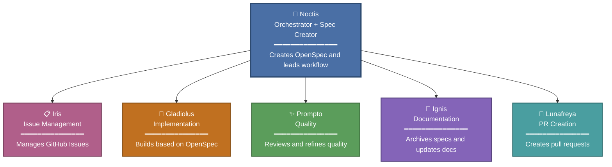
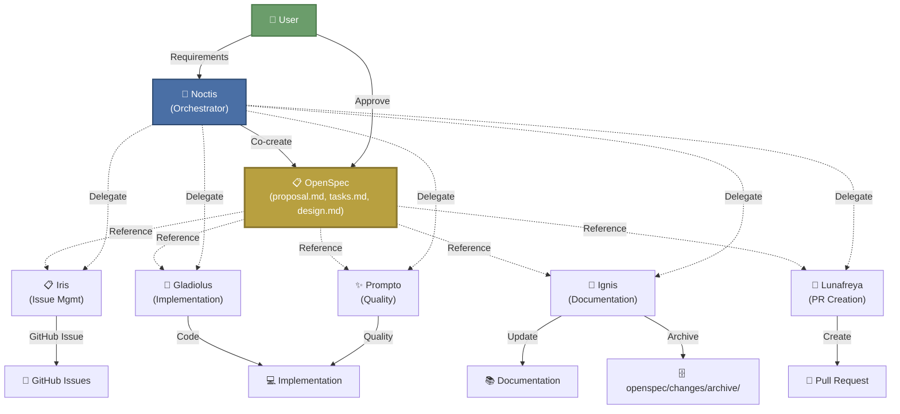

# FF15 OpenSpec Agents


Agent Orchestration with OpenSpec-Driven Development

## Overview

This repository demonstrates **agent orchestration** using GitHub Copilot's multi-agent capabilities, combined with **[OpenSpec](https://github.com/Fission-AI/OpenSpec)** for specification-driven development.

When orchestrating subagents, unclear specifications can lead to unintended implementations. This project addresses that by using **OpenSpec** to define authoritative specifications upfront. Subagents then implement and refactor code based on these agreed-upon specs, ensuring predictable and auditable development.

### Why FF15?

The agent team is inspired by **Final Fantasy XV** characters, each with distinct roles:

- **Noctis** - Orchestrator & OpenSpec Creator
- **Iris** - GitHub Issue Manager
- **Gladiolus** - TDD Implementation Specialist
- **Prompto** - Code Quality & Refactoring
- **Ignis** - Documentation & Archiving
- **Lunafreya** - Pull Request Creator

### Team Structure

Noctis acts as the central orchestrator, coordinating specialized agents:



Each agent has a specific domain of expertise and works autonomously within their role, while Noctis ensures cohesive workflow orchestration.

## Features

✅ **Specification-Driven Development** - Define specs before implementation using OpenSpec  
✅ **Role-Based Agent Orchestration** - Clear separation of concerns across specialized agents  
✅ **Human-AI Collaboration** - Humans approve specs; AI implements autonomously  
✅ **Traceable Development** - All changes tracked via OpenSpec proposals and archives  
✅ **Quality Assurance** - Built-in review policies and TDD principles

## Prerequisites

- **Node.js** >= 20.19.0 ([Download](https://nodejs.org/))
- **GitHub Copilot** (VS Code or compatible editor)
- **Git** (for version control)
- **OpenSpec CLI** (installation steps below)
- **Go** 1.18+ for the local `ff15` bootstrap CLI

## Quick Start

### 1. Install OpenSpec

```bash
npm install -g @fission-ai/openspec@latest
```

Verify installation:

```bash
openspec --version
```

### 2. OpenSpec Viewers

If you want a dedicated viewer for OpenSpec artifacts, these options fit this stack well and remain optional. You can include them during setup with `ff15 init --optional-tools spek,dossier`.

- **[spek](https://github.com/spekhq/spek)** - Best general-purpose viewer. Read-only, local-first, web/VS Code/IntelliJ support, and static site generation via GitHub Action.
  - Quick start: `npx @spekjs/web` or install the VS Code / IntelliJ extension.
- **[dossier](https://github.com/fselich/dossier)** - Best terminal-native option. Lightweight TUI for developers who prefer keyboard navigation.
  - Quick start: `go install github.com/fselich/dossier/cmd/dossier@latest`

### 3. Initialize Your Project

```bash
cd your-project
openspec init
ff15 init --target .
```

The initialization process:

- Prompts you to select your AI tool (Claude Code, Cursor, etc.)
- Creates `AGENTS.md` in your project root
- Sets up `openspec/` directory structure
- Configures slash commands for your AI assistant
- Patches the selected ecosystem guidance files under the target project root
- Syncs FF15 agent, prompt, and policy assets into `.claude/agents`, `.kiro/steering`, and `.opencode/agents` when those ecosystems are selected

**Important**: Restart your AI assistant after initialization to enable slash commands.

### 4. Optional: Re-sync FF15 Assets

Use the Go CLI from this repository when you want to re-apply embedded agent, prompt, and policy assets:

```bash
ff15 sync --target .
```

This command can:

- Re-sync agent definitions into ecosystem-specific folders
- Re-sync prompt definitions and policy docs
- Re-apply managed policy blocks when needed
- Read sync assets from the `ff15` binary's embedded bundle (no local `.claude/skills/ff15-openspec-agents-sync` required at runtime)

### 5. Start Developing

Request your AI assistant to create a proposal:

```
Create an OpenSpec proposal for adding user authentication
```

The workflow will guide you through specification, implementation, review, and PR creation.

## FF15 CLI

This repository also ships a Go CLI named `ff15` for Linux and Windows bootstrap work.

### Build or install

```bash
go build ./cmd/ff15
```

or:

```bash
go install ./cmd/ff15
```

### Global installation

After building, move the binary to a directory in your `PATH` so you can run `ff15` from anywhere.

**Linux / macOS:**

```bash
sudo cp ff15 /usr/local/bin/ff15
```

**Windows:**

1. Copy `ff15.exe` to a user directory, e.g. `C:\Users\<YourUser>\bin\`
2. Add that directory to your `PATH` environment variable:
   - Open **Settings → System → About → Advanced system settings → Environment Variables**
   - Under **User variables**, edit `Path` and add `C:\Users\<YourUser>\bin\`
3. Restart your terminal for the changes to take effect

### Run the init flow

Default interactive wizard:

```bash
ff15
```

Explicit flag form:

```bash
ff15 --init
```

Alias form:

```bash
ff15 init
```

Help output:

```bash
ff15 --help
```

Non-interactive dry run:

```bash
ff15 --dry-run --yes --ecosystems claude,kiro,pi,opencode --optional-tools rtk
```

### Run the sync flow

List available sync assets:

```bash
ff15 sync --list
```

Sync everything into all supported ecosystem targets for a project:

```bash
ff15 sync --target .
```

Limit sync to specific ecosystems from the compiled binary:

```bash
ff15 sync --target . --ecosystems claude,kiro,pi,opencode
```

Sync selected files only:

```bash
ff15 sync --target . --ecosystems claude,opencode --agents noctis,ignis --prompts noctis --docs development-policy.md
```

Mode flags always keep the selected ecosystems' managed guidance files in sync as well:

```bash
ff15 sync --target . --ecosystems claude --agents-only
ff15 sync --target . --ecosystems opencode --prompts-only
ff15 sync --target . --ecosystems kiro --docs-only
```

Other useful flags:

- `--ecosystems` accepts `claude`, `kiro`, `pi`, and `opencode`; if omitted, sync writes to all supported ecosystems
- `--force` overwrites existing synced files without prompting
- `--dry-run` prints planned changes without writing files

`ff15 sync` embeds its bundled agents, prompts, docs, and `AGENTS.md` template into the Go binary with `embed`, so compiled binaries can run sync without depending on the repository's `.claude/skills/ff15-openspec-agents-sync` directory being present nearby.

### What the CLI does

- Detects Linux or Windows
- Starts the existing Bubble Tea init wizard by default when run without a subcommand
- Keeps `--help` focused on commands and flags
- Keeps `--init` available as an explicit alias for the same init flow
- Plans mandatory tools: Engram, CodeGraph, OpenSpec
- Lets you opt into Headroom and RTK
- Patches `AGENTS.md`, `CLAUDE.md`, `.pi/AGENTS.md`, and ecosystem-specific folders with managed blocks
- Routes bundled agents, prompts, and docs into `.claude/agents/`, `.kiro/steering/`, and `.opencode/agents/` based on sync ecosystem selection

### Deploy script

`./deploy.sh` runs focused repository checks and then builds release binaries:

- verifies required paths exist: `cmd/ff15`, `internal/ff15`, `openspec/changes`
- fails if `gofmt -l cmd/ff15 internal/ff15` reports formatting drift
- runs `go test ./cmd/ff15 ./internal/ff15`
- builds `ff15` for Linux and `ff15.exe` for Windows in the current directory with `-trimpath -buildvcs=false`

## Project Structure

```
.
├── AGENTS.md
├── cmd
│   └── ff15
│       └── main.go
├── deploy.sh
├── docs
│   ├── deployment-policy.md
│   ├── development-policy.md
│   ├── review-policy.md
│   └── testing-policy.md
├── go.mod
├── go.sum
├── internal
│   └── ff15
│       ├── cli.go
│       ├── cover.go
│       ├── model.go
│       ├── patcher.go
│       ├── planner.go
│       ├── runtime.go
│       ├── sync.go
│       ├── syncassets/        # Embedded sync assets
│       │   ├── agents/
│       │   ├── docs/
│       │   └── prompts/
│       └── ui.go              # Bubble Tea init wizard
├── openspec/
│   ├── AGENTS.md
│   ├── changes/
│   │   └── archive/
│   └── project.md
└── skin/
    └── chocobo.png
    └── ascii.txt
```

## Agents

### Noctis - Orchestrator & OpenSpec Creator

Coordinates the entire workflow and creates OpenSpec proposals with detailed specifications.

### Iris - Issue Manager

Creates and manages GitHub Issues based on user requirements and proposals.

### Gladiolus - Implementation Specialist

Executes implementation following TDD principles, guided by OpenSpec specifications.

### Prompto - Code Quality Expert

Reviews code against OpenSpec, applies review policies, and refactors for clarity and maintainability.

### Ignis - Documentation Specialist

Updates documentation, archives completed OpenSpec changes, and ensures documentation completeness.

### Lunafreya - PR Creator

Creates pull requests for completed implementations with proper descriptions and links.

## Development Workflow

### OpenSpec-Driven Collaboration

The workflow centers around **OpenSpec** as the single source of truth. Users and Noctis collaboratively create specifications, which all agents reference during implementation:



**Key Points:**

- 📋 **OpenSpec is central** - All agents reference the same specification
- 👤 **Human approval required** - Users approve specs before implementation
- 🔄 **Coordinated execution** - Noctis delegates to specialized agents
- 📚 **Traceable changes** - All work links back to the original spec

**Typical Flow:**

1. **Request** → User describes a feature or change
2. **Specification** → Noctis creates an OpenSpec proposal
3. **Issue Tracking** → Iris creates GitHub Issue(s)
4. **Implementation** → Gladiolus implements following TDD
5. **Quality Review** → Prompto reviews and refactors
6. **Documentation** → Ignis updates docs and archives spec
7. **Pull Request** → Lunafreya creates PR for review

## Usage Guide

For detailed instructions on using the FF15 OpenSpec workflow, see:

📖 [.claude/skills/ff15-openspec-agents-sync/USAGE.md](.claude/skills/ff15-openspec-agents-sync/USAGE.md)

## Troubleshooting

### OpenSpec command not found

Ensure OpenSpec is installed globally:

```bash
npm install -g @fission-ai/openspec@latest
```

Verify with `openspec --version`.

### Agents not recognized

1. Verify `.claude/agents/` directory contains agent definitions
2. Run the `ff15-openspec-agents-sync` skill to re-sync
3. Restart your AI assistant

### Skill sync fails

`ff15 sync` now uses embedded assets, so a compiled binary does not need a nearby `.claude/skills/ff15-openspec-agents-sync/` directory. If sync still fails, rebuild or reinstall `ff15` so the binary includes the latest embedded bundle:

```bash
go build ./cmd/ff15
```

## Best Practices

- **Always start with OpenSpec** - Create proposals before coding
- **Keep project.md updated** - Document conventions and architecture
- **Review proposals before implementation** - Human approval ensures alignment
- **Use policy documents** - Reference `docs/*-policy.md` for standards
- **Archive completed changes** - Maintain history for future reference

## References

- **OpenSpec**: <https://github.com/Fission-AI/OpenSpec>
- **OpenSpec Official Site**: <https://openspec.dev/>
- **Detailed Usage Guide**: [USAGE.md](.claude/skills/ff15-openspec-agents-sync/USAGE.md)

## License

MIT License - See [LICENSE](LICENSE) file for details

---

**Built with ❤️ using GitHub Copilot and OpenSpec**
